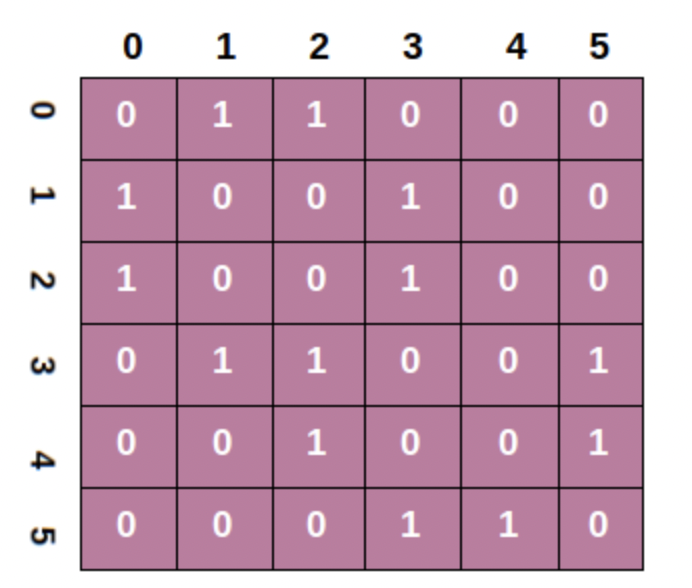

# 너비 우선 탐색 (Breadth-First Search)
그래프 검색 알고리즘의 하나이다. 
현재 탐색 노드에 연결된 모든 노드들을 탐색후 다음 탐색을 진행한다.   
그래프에서 가장 일반적으로 사용되는 연결된 모든 노드를 탐색하는 알고리즘이다. 

## 구현
 


다음과 같은 순서로 탐색이 진행된다. 이를 구현하기 위해자 료구조 큐(Queue)의 선입선출 특성을 이용해 구현한다.  

1. 탐색 시작 노드를 큐에 넣는다.
2. 현재 큐 FrontTop의 노드와 연결된 모든 노드를 큐에 넣는다.
3. Pop 연산을 진행한다.
4. 2번으로 돌아가 방문한 노드가 없을 때까지 loop 를 진행한다.




보통 코테에서는 2차원 배열로 트리를 구성하거나 
2차원 배열 자체를 맵으로 사용해 BFS 적용 시키는 경우가 많다.
일단 기본적으로 외워야하는 코드는 다음과 같다
```cpp
//map 방문 기록
int board[map_y][map_x];
int visited[map_y][map_x];
int dy[4] = {0, 0, 1, -1};
int dx[4] = {1, -1, 0, 0};
// N = y좌표 , M = x좌표
int N, M;

void BFS(int posy, int posx){
    //시작 노드 큐에 넣기
    queue<pair<int,int>> q;
    q.push({posy,posx});
    visited[posy][posx] = 1;
    //2번 과정 이후 loop문
    while(!q.empty()){
        pair<int, int> cur = q.front(); q.pop();
        for(int i=0;i<4;++i){
            int ny = dy[i] + cur.first;
            int nx = dx[i] + cur.second;
            //map 범위를 벗어난 좌표이동
            if(ny < 0 || ny >= N || nx < 0 || nx >= M ) continue;
            //없는 경로거나 이미 방문했던 곳
            if(board[ny][nx]!=1 || visited[ny][nx]) continue;
            visited[ny][nx] = 1;
            q.push({ny,nx});
        }
    }
}
```

## Applications of BFS algorithm

The applications of breadth-first-algorithm are given as follows -

1. BFS can be used to find the neighboring locations from a given source location.
   - 현재 노드에서 주변 노드를 검색하는 연산
2. In a peer-to-peer network, BFS algorithm can be used as a traversal method to find all the neighboring nodes. Most torrent clients, such as BitTorrent, uTorrent, etc. employ this process to find "seeds" and "peers" in the network.
   - P2P 네트워크에서 전체 네트워크 횡단 방법 예를 들어 토렌트 클라이언트 들에서는 시드와 피어를 찾기위해 bfs 알고리즘을 실행한다. 
3. BFS can be used in web crawlers to create web page indexes. It is one of the main algorithms that can be used to index web pages. It starts traversing from the source page and follows the links associated with the page. Here, every web page is considered as a node in the graph.
   - 웹 크롤러시 인덱싱 과정에서 사용되는 주요 알고리즘 BFS
4. BFS is used to determine the shortest path and minimum spanning tree.
   - 최소 신장 트리에서 최단 경로 찾는데 사용되는 알고리즘 
   - 다익스트라 알고리즘, 프림 알고리즘의 기본 토대
5. BFS is also used in Cheney's technique to duplicate the garbage collection.
    - 체니 알고리즘에서 사용됨 
6. It can be used in ford-Fulkerson method to compute the maximum flow in a flow network.
   - 네트워크 최대 흐름을 계산하는데 사용
# BFS 문제


[문제집 링크](https://www.acmicpc.net/workbook/view/7313)

| 문제 분류 | 문제 | 문제 제목 | 정답 코드 |
| :--: | :--: | :--: | :--: |
| 연습 문제 | 1926 | [그림](https://www.acmicpc.net/problem/1926) | -  |
| 연습 문제 | 2178 | [미로 탐색](https://www.acmicpc.net/problem/2178) | [정답](../../problems/BFS/미로탐색.cpp) |
| 연습 문제 | 7576 | [토마토](https://www.acmicpc.net/problem/7576) | -  |
| 연습 문제 | 4179 | [불!](https://www.acmicpc.net/problem/4179) | -  |
| 연습 문제 | 1697 | [숨바꼭질](https://www.acmicpc.net/problem/1697) | -  |
| 기본 문제✔ | 1012 | [유기농 배추](https://www.acmicpc.net/problem/1012) | - |
| 기본 문제✔ | 10026 | [적록색약](https://www.acmicpc.net/problem/10026) | -  |
| 기본 문제✔ | 7569 | [토마토](https://www.acmicpc.net/problem/7569) | -  |
| 기본 문제✔ | 7562 | [나이트의 이동](https://www.acmicpc.net/problem/7562) | -  |
| 기본 문제✔ | 5427 | [불](https://www.acmicpc.net/problem/5427) | -  |
| 기본 문제 | 2583 | [영역 구하기](https://www.acmicpc.net/problem/2583) | - |
| 기본 문제 | 2667 | [단지번호붙이기](https://www.acmicpc.net/problem/2667) | - |
| 기본 문제 | 5014 | [스타트링크](https://www.acmicpc.net/problem/5014) | -  |
| 기본 문제 | 2468 | [안전 영역](https://www.acmicpc.net/problem/2468) | - |
| 기본 문제 | 6593 | [상범 빌딩](https://www.acmicpc.net/problem/6593) | -  |
| 응용 문제✔ | 2206 | [벽 부수고 이동하기](https://www.acmicpc.net/problem/2206) | - |
| 응용 문제✔ | 9466 | [텀 프로젝트](https://www.acmicpc.net/problem/9466) | -  |
| 응용 문제✔ | 2573 | [빙산](https://www.acmicpc.net/problem/2573) | -  |
| 응용 문제✔ | 2146 | [다리 만들기](https://www.acmicpc.net/problem/2146) | -  |
| 응용 문제✔ | 13549 | [숨바꼭질 3](https://www.acmicpc.net/problem/13549) | -  |
| 응용 문제✔ | 1600 | [말이 되고픈 원숭이](https://www.acmicpc.net/problem/1600) | -  |
| 응용 문제 | 13913 | [숨바꼭질 4](https://www.acmicpc.net/problem/13913) | -  |
| 응용 문제 | 14442 | [벽 부수고 이동하기 2](https://www.acmicpc.net/problem/14442) | -  |
| 응용 문제 | 16933 | [벽 부수고 이동하기 3](https://www.acmicpc.net/problem/16933) | -  |
| 응용 문제 | 16920 | [확장 게임](https://www.acmicpc.net/problem/16920) | -  |
| 응용 문제 | 11967 | [불켜기](https://www.acmicpc.net/problem/11967) | -  |
| 응용 문제 | 17071 | [숨바꼭질 5](https://www.acmicpc.net/problem/17071) | -  |
| 응용 문제 | 9328 | [열쇠](https://www.acmicpc.net/problem/9328) | -  |
| 응용 문제 | 3197 | [백조의 호수](https://www.acmicpc.net/problem/3197) | -  |
| 응용 문제 | 20304 | [비밀번호 제작](https://www.acmicpc.net/problem/20304) | - |

