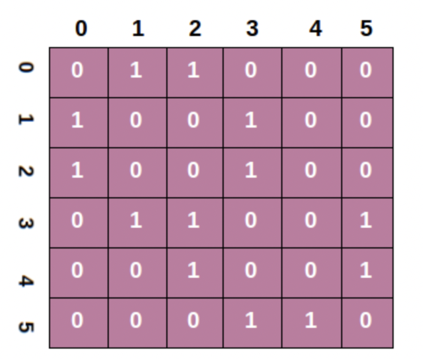

#배열

 한 메모리 청크에 저장되는 연속적인 속성의 자료구조이다. 
 모든 요소는 서로 같은 타입의 데이터이며 이는 같은 크기의 메모리를 사용한다는 뜻

 각 원소들은 연속된 숫자들의 인덱스로 구분을 하며 인덱스는 많은 언어에서 0부터 시작한다.

### C 스타일 배열 
- 정적 배열$_{static}$- 스택 메모리 영역 할당
- 동적 배열$_{dynamic}$- 힙 메모리 영역 할당
    

→ 서로 동일 성능임 → 원소 접근 시간 복잡도 $O(1)_{Big-O}$

원소 접근에는 $O(1)$ 상수 접근 시간으로 빠르게 접근이 가능하지만 
추가와 삭제에 있어서는 $O(N)$ 의 선형 증가 복잡도를 가진다. 

### array 주소 계산 (zero base)
선형 접근 시간을 가지는 이유는 인덱싱으로 값에 접근할 때 다음의 식으로 메모리 공간에 접근한다.
| 1차원 배열 | 시작주소 + 요소 사이즈 * ( 인덱스 값) |
| --- | --- |
| 2차원 배열  | 시작주소 + 요소 사이즈 * ( ( 행 - 1 ) + 인덱스 값 ) |

### 메모리 저장 방식
컴퓨터 메모리 공간의 저장방식은 2차원이 아닌 1차원으로 길게 저장이 된다.
그렇다면 2차원 배열은 어떤 방식으로 메모리에 저장이 되는가? 

2차원 배열이 있고 각 배열의 위치는 (0,0) 으로 나타낼 수 있다면
행 우선방식과 열 우선 방식은 각각 다음과 같이 일렬로 저장 된다.

한가지 유의 할 점은 2차원 이상의 배열에서도 열 우선이면 
배열의 각 공간을 구분 짓는 제일 큰 단위를 우선으로 메모리에 일렬로 저장된다.

예를 들면 3차원 배열에서 열 우선이면 (1,1,1) (2,1,1) (3,1,1) ... 같이 저장된다.

### 캐시 지역성$_{cache\,locality}$
  - 원소들이 인접해 있기 때문에 하나의 원소 접근시 인근 원소도 같이 캐시로 가져옴
  - 이는 어떤 연산에 점근적 시간 복잡도 계산에는 영향X
  - but 연속된 원소에 매우 빠르게 접근 가능하다.