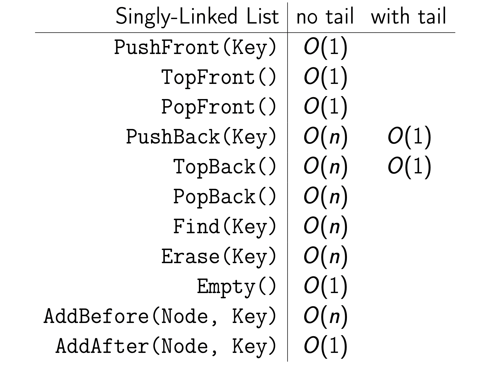

# 싱글 연결 리스트

---

- node라 불리는 여러개의 메모리 청크에 데이터를 저장한다

→ 이 경우 서로 다른 메모리 위치에 데이터가 저장된다.

- **연결 리스트**$_{linked\,list}$
    - 데이터 저장 공간
    - 다음 노드를 가르키는 포인터 (리스트 끝 노드는 NULL값)
    - **특정 원소 접근시 무조건 헤드부터 접근** 
    - 원소 접근 시간 복잡도 $O(n)_{Big-O}$
    
    →매우 빠른 **원소의 삽입**, **삭제** (잦은 추가,제거가 필요한 데이터에 적합함)
    
→ but 캐시 지역성 X (모든 원소 방문 작업은 같은 시간복잡도 이지만 성능이 조금 떨어짐)

### node
시작을 나타내는 head 와 tail 노드를 제외하고는 각 노드들은
key(데이터 값)와 다음 노드를 가르키는 point 공간을 가진다. 

- key
- pointer

리스트의 시작과 끝을 표시하는 노드가 존재하면 연산이 조금 더 간단해진다. 
일반적으로 head 노드는 필수적으로 존재하며 여기에 tail 추가적으로 존재하면 연산이 좀 더 간단해진다 → 시간 복잡도 줄어듬

### API

추상적 자료구조에서는 기능 또한 같이 포함되어 있어야한다. 
리스트에 필요한 기본 기능들은 위와 같다.

끝을 나타내는 tail 노드 존재 유무에 따라 시간 복잡도가 달라지기도 한다. 
기본적인 추가, 제거의 구현만 한번 해보자.

### API 코드 구현