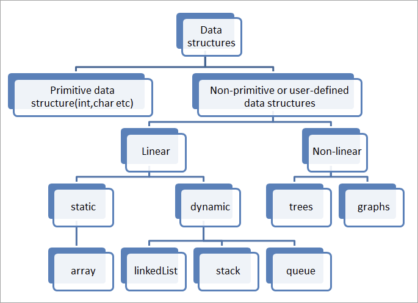

### 참고

  

[Data Structures - GeeksforGeeks](https://www.geeksforgeeks.org/data-structures/?ref=shm)

  

[Data Structures](https://www.coursera.org/learn/data-structures)

## 자료구조란?

  

  

데이터 그룹의 요소를 쉽게 저장하는 방법, 데이터들의 각각의 처리 방법 (검색, 정렬, 업데이트 등…)

  

- *효과적으로 데이터를 조직화*

- *효율적으로 데이터 처리*

  

→ **공간복잡도**와 **시간복잡도**를 줄임

  

## 자료구조의 필요성

  

  

프로그래머는 아래 기준을 충족시키기 위해 적절한 **자료구조**와 **알고리즘**을 선택해야한다.

  

1. *프로그램의 필요 기능 구현*

2. *동작 성능과 안정성 확보*

  

→ 이를 통해 따라오는 것 (자료구조를 이해함으로)

  

	- 성능의 향상

	- 표준화

	- 가독성

	- 유지 보수의 편리

  

응용 프로그램 설계시 가장 중요한 것 → 데이터 관리 (연산 과정의 반복) → 적절한 자료구조 선택 필요

  

## 자료구조

  

  

### ADT → 자료구조의 포멀한 정의 

  

추상적 데이터 타입$_{abstract\,data\,type}$ 은 3가지가 정의되어야 한다.

	- 데이터 식별 기준

	- 동작

	- 공리

*<참고:[https://velog.io/@chldntjr0425/자료형과-대수적-구조-간의-유사성-zfdvt3hm](https://velog.io/@chldntjr0425/%EC%9E%90%EB%A3%8C%ED%98%95%EA%B3%BC-%EB%8C%80%EC%88%98%EC%A0%81-%EA%B5%AC%EC%A1%B0-%EA%B0%84%EC%9D%98-%EC%9C%A0%EC%82%AC%EC%84%B1-zfdvt3hm)>*

  

### 자료구조 타입

  

1. 선형 자료구조

	- 요소들이 한차원 혹은 선형 차원으로 배열되는것 , 요소들간 관계가 1:1 → 데이터 뒤에 데이터 , 연결

	→ List, Stack , Queue, etc.

2. 비선형 자료구조

	- 요소들간 관계가 1:N , N:1, N:N 차원으로 배열되는 것, 자료들간 앞 뒤 관계, 연결 x

→Tree , Graph , Table , etc.

  

### 데이터 타입과 차이점 

  

1. 데이터 타입

	- 값을 할당 할 수 있는 변수 형태의 이름

	- 주어진 데이터 값에 대한 타입만 정의함

	→ 데이터는 아니다. → 실제 저장되지 않음

	- 동작을 추상적으로만 정의 ( int → 정수형, float → 실수형 … ,etc)

2. 자료구조

	- 여러 종류의 데이터 모음집

	- 쉽게 생각해 객체라고 생각하면 된다.

	→ 여러 타입의 데이터를 가진 객체 
	(데이터 타입 값이 모여 유의미한 데이터가 된다)

	- 구체적으로 동작을 정의함

	- 메모리에 저장되는 실제 구조가 정의되어 있음

	→ 실제 저장되는 방식이라 보면된다.

  

***Classfication of data structure***

  

  

1. Linear

	1. Static 정적 (고정된 메모리)

		- 배열	

	2. Dynamic 동적 (런타임에 의해 결정되는 메모리 공간)

		- 연결 리스트
		- 스택
		- 큐

2. Non-linear
	- 트리
	- 그래프
